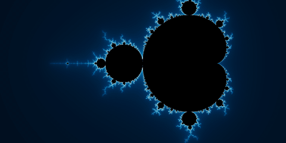
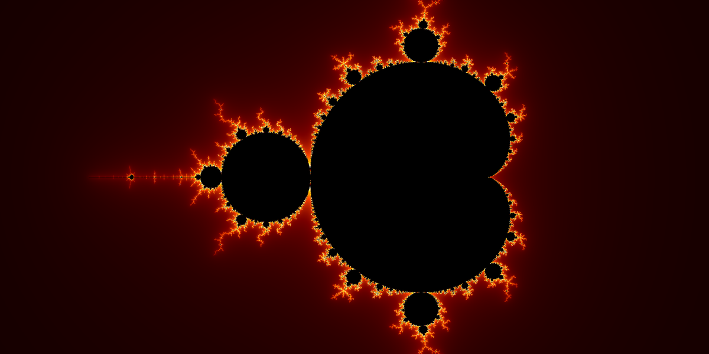
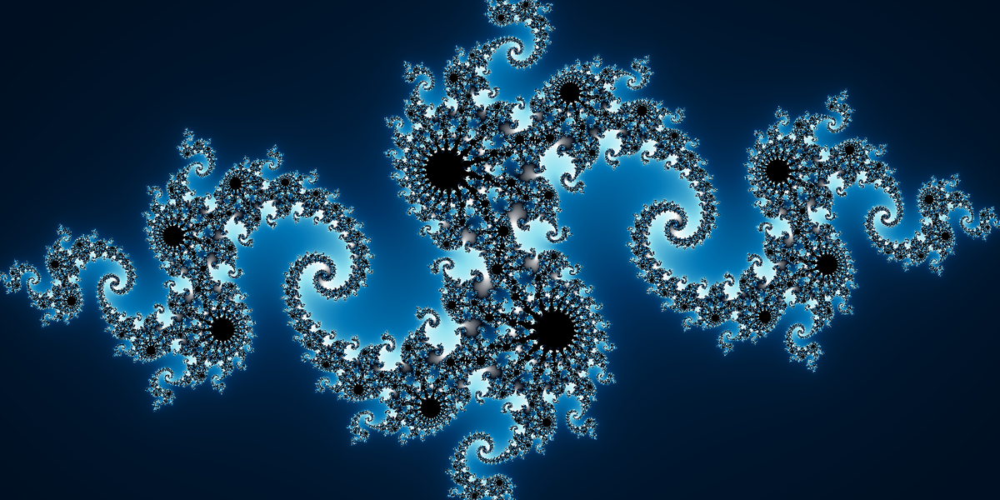
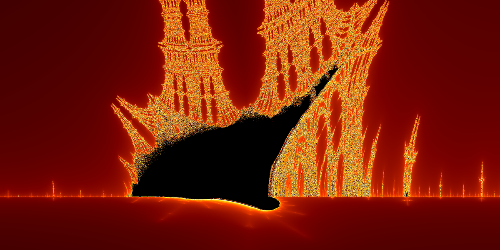
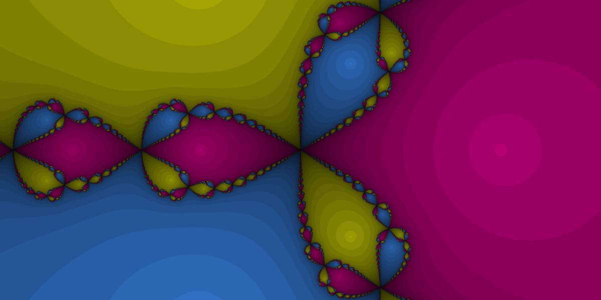
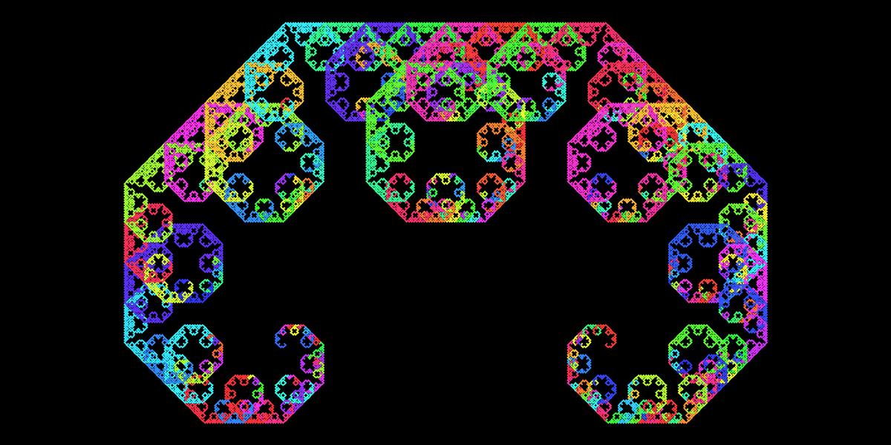
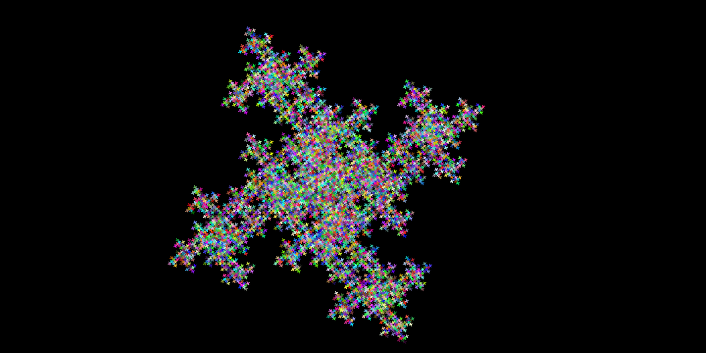
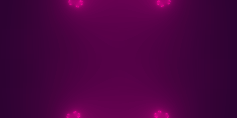
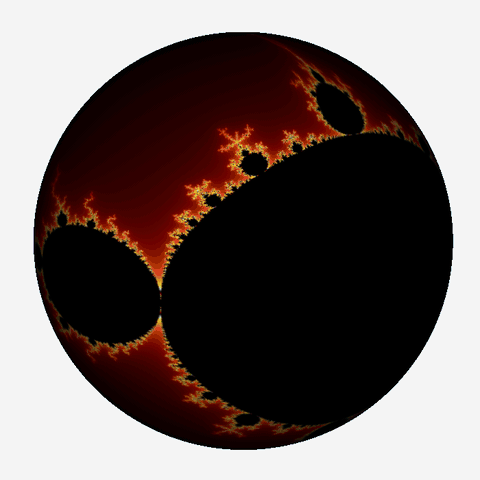

# 3D fractal viewer

A **JavaFX** desktop app that generates fractals and wraps them as a texture on a **3D sphere** you can rotate, with PNG export.



> School project, DUT Informatique, University of Bordeaux (2017), by Laurent Genty and Luis Palluel. Revived in 2026: Maven build, modern JavaFX, new fractals, smooth coloring and parallel rendering.

## Gallery

| Mandelbrot | Julia |
|---|---|
|  |  |
| **Burning Ship** | **Newton (z³ − 1)** |
|  |  |
| **Lévy C curve** | **Recursive square** |
|  |  |



## On the 3D sphere

| Sphere spin | Tour of the six fractals |
|---|---|
|  |  |

Videos: [deep zoom](docs/media/deep-zoom.mp4) · [Julia morph](docs/media/julia-morph.mp4) · [sphere spin](docs/media/sphere-spin.mp4) · [tour](docs/media/tour.mp4)

## Features

- Six fractals: **Mandelbrot**, **Julia**, **Burning Ship**, **Newton (z³ − 1)**, **Lévy C curve** and a recursive **square** fractal.
- Smooth coloring (no color bands) and four palettes: Classic (2017), Fire, Ocean, Neon.
- Configurable parameters (iterations, Julia constant) with input validation.
- Fractal rendered as a texture on a 3D sphere, rotatable with the mouse.
- Parallel rendering on all CPU cores.
- Export of the current fractal to PNG.
- Scripted demo mode that regenerates every image and video of this README.

## Getting started

Requirements: JDK 24 or later (OpenJFX 26 is fetched by Maven) and Maven.

```bash
mvn javafx:run
```

Regenerate the media in `docs/media/` (requires `ffmpeg`, takes a few minutes):

```bash
scripts/make-media.sh
```

## Architecture

Classic **MVC** from 2017, plus a pure-Java rendering core added in 2026:

```
src/main/java/
  application/Application.java   # entry point (--demo starts the demo mode)
  modele/                        # model (observable) + ViewState
  vue/SphereViewer.java          # JavaFX view: 3D scene, controls
  controleur/                    # one controller per fractal family + MainController
  fractal/                       # rendering core, no JavaFX: palettes, escape-time and Newton renderers
  demo/                          # scripted clips and frame capture
  exceptions/                    # input validation errors
```

Tests: `mvn test`.
